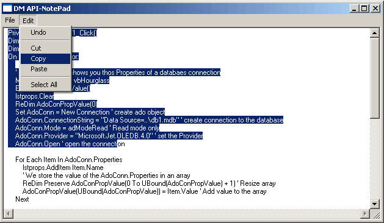



## DM ALL API NotePad

### Description

Hi well as promised. I have updated My ALL API Windows. to a NotePad program. yes it is all pure API code. Supports Open and Save, Cut, Copy, Paste, Select All. and also has support for Droping of files. anyway hope you find this usfull. I make a new update as soon.
 
### More Info
 

             |
---                |---
**Submitted On**   |2005-03-16 18:55:52
**By**             |[dreamvb](https://github.com/Planet-Source-Code/PSCIndex/blob/master/ByAuthor/dreamvb.md)
**Level**          |Beginner
**User Rating**    |5.0 (65 globes from 13 users)
**Compatibility**  |VB 6\.0
**Category**       |[Complete Applications](https://github.com/Planet-Source-Code/PSCIndex/blob/master/ByCategory/complete-applications__1-27.md)
**World**          |[Visual Basic](https://github.com/Planet-Source-Code/PSCIndex/blob/master/ByWorld/visual-basic.md)
**Archive File**   |[DM\_ALL\_API1865293162005\.zip](https://github.com/Planet-Source-Code/dreamvb-dm-all-api-notepad__1-59508/archive/master.zip)

